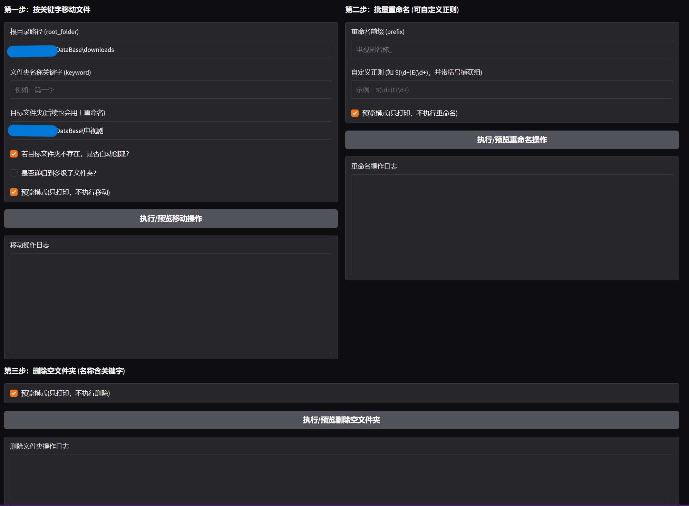

# Agent-for-Docker-Xunlei

Docker迅雷的助手，解决批量磁力链接下载与批量电视剧移动与重命名。

由于每个磁力文件名称的不确定性和服务器地址与文件名的特殊性，该项目需要人工介入，并保证省去重复人工劳动。

基于https://github.com/cnk3x/xunlei?tab=MIT-1-ov-file

## 功能

- **磁力链接批量下载**：
  - 无需迅雷会员即可批量下载磁力。
- **文件批量移动**：
  - 由于多条磁力链接（一般为电视剧下载），会创建多个文件夹，每个文件夹下为一集，人工移动文件费时费力，因此开发该功能。
  - 匹配相同关键词的文件夹，并将其文件夹下的文件移动到指定文件夹下（若不存在，自动创建）。
- **批量重命名**：
  - 使用正则表达式，一键修改文件名称，例如：`行s走rS02E03 ,..., 行s走rS05E04` → `行尸走肉 - S02E03 ,..., 行尸走肉 - S05E04`。

## 批量下载流程
1、将所有的磁力粘贴至输入框

2、点击下载，不要关闭Gradio页面，等待任务全部添加完成，大约20秒一个任务

## 批量移动&重命名流程
1、配置 迅雷下载目录，下载文件的关键词，目标文件夹，完成批量移动

2、配置 预期文件名称，正则匹配下载文件，完成批量重命名

3、删除迅雷下载目录的空文件夹（根据第一步的关键词）

## 使用方法
<details>
<summary><strong>For Windows（简单，非all in one）</strong></summary>

### 环境准备

#### 1. 安装依赖

确保已安装 Python 3.x，然后运行以下命令安装项目依赖：
```bash
pip install -r requirements.txt
```
或
```bash
pip install -r gradio selenium paramiko chromedriver-autoinstaller
```

#### 2. 修改app.py配置

主要修改的有四个配置变量：
`SERVER_IP`为服务器IP地址
`DOWNLOAD_PAGE_URL`为迅雷下载界面网址
`REMOTE_PATH_CHOICES`是服务器本地的下载地址（由于Docker迅雷的需要很高的权限，如果不修改其PID与GID，在后续的移动文件部分会很麻烦，因此需要迅雷文件夹地址进行Chmod -R 777，如果修改过PID/GID无需填写。
`LOCAL_FOLDER_CHOICES`为SMB协议下，访问迅雷下载文件夹的地址
示例如下：
```bash
SERVER_IP="100.97.*.*"
DOWNLOAD_PAGE_URL = "http://100.97.*.*:2345"
REMOTE_PATH_CHOICES = [
        "/srv/Device/DataBase/Xunlei_download",
        "/srv/Device/DataBase2/Xunlei_download"
    ]
LOCAL_FOLDER_CHOICES = [
        r"\\100.97.*.*\DataBase\Xunlei_download",
        r"\\100.97.*.*\DataBase2\Xunlei_download"
    ]
```
#### 3. 运行并进入 Gradio

运行以下命令启动 GUI 界面：
```bash
python app.py
```

访问：
```bash
127.0.0.1:7861
```
或
```bash
192.168.*.*:7861
```
---
### 4. 选择批量处理TAB

主要探讨批量处理部分：
---
### 第一步-登录服务器并查看迅雷下载文件夹


输入服务器的用户名与密码，如果修改过迅雷的PID、GID则无需此步操作，仅需确认SMB协议下的访问地址点击读取文件夹结构。
若熟悉自己下载的文件名称，则无需点击。

---

### 第二步-批量移动与重命名


1. **根目录（下载目录）**：根目录为迅雷下载目录，点击预览子文件夹来展示目录下的文件夹以便挑选关键词。
2. **文件夹关键词**：该变量用于匹配文件夹名称，相当于选择特定文件夹进行操作（无正则表达式）。
3. **目标文件夹**：指定文件夹，将需要移动的文件移动到该文件夹（若不存在则自动创建）。

填完上述三个变量后，点击执行移动并确认无误后，关闭预览模式，实际执行移动。

移动完成后需要填写 **重命名前缀** 与 **自定义正则式**。

#### 例如：

现有 `行s走rS02E03`、`行s走rS02E04`，
- **重命名前缀** 填写为 `行尸走肉 - S`
- **自定义正则式** 填写为 `S(\\d+E\\d+)`

即可重命名为：
```bash
行尸走肉 - S02E03
行尸走肉 - S02E04
```

1. **重命名前缀**：期望的文件夹名称，例如 `行s走r` → `行尸走肉`。
2. **自定义正则式**：匹配括号内的正则表达式并返回匹配值。

填完上述两个变量后，点击执行重命名并确认无误后，关闭预览模式，实际执行重命名。

---
### 第三步-删除空文件夹

最后，删除迅雷下载目录的空文件夹（自动匹配之前的关键词），同样需要关闭预览模式进行实际删除。

</details> <details> <summary><strong>For Docker（在服务器上运行，all in one）</strong></summary>

### 测试环境

- 已在树莓派4B-4GB OMV系统上进行测试
- ```bash
  ~# cat /etc/os-release
  >>>
  PRETTY_NAME="Debian GNU/Linux 12 (bookworm)"
  NAME="Debian GNU/Linux"
  VERSION_ID="12"
  VERSION="12 (bookworm)"
  VERSION_CODENAME=bookworm
  ID=debian
  HOME_URL="https://www.debian.org/"
  SUPPORT_URL="https://www.debian.org/support"
  BUG_REPORT_URL="https://bugs.debian.org/"
  ```

### 前置条件
- 确保已安装 Docker 和 Docker Compose。

### 1. 代理设置说明

构建时使用了代理，如需调整代理，修改`docker-compose.yml`中的以下部分，这是保证Dockerfile稳定安装而配置的代理：

```yaml
args:
  HTTP_PROXY: "http://你的IP地址:10809"
  HTTPS_PROXY: "http://你的IP地址:10809"
```
### 2. 目录映射说明

容器已将主机以下路径映射至容器内对应位置：

| 主机路径                              | 容器路径       |
|-----------------------------------|---------------|
| `/srv/硬盘位置/DataBase`            | `/DataBase`   |
| `/srv/硬盘位置/DataBase2`           | `/DataBase2`  |
| `/srv/硬盘位置/DataBase/docker_staff/move_rename` | `/app`        |

### 3. 构建镜像并启动容器

在含有 `docker-compose.yml` 文件的目录中，执行以下命令构建镜像并启动容器：

```bash
docker-compose up -d --build
```

### 4. 访问服务

启动完成后，通过浏览器访问以下地址进入 Gradio 界面：

- 本地访问：
```bash
http://127.0.0.1:7861
```

- 局域网访问（替换为实际IP）：
```bash
http://192.168.*.*:7861
```


## 批量下载磁力界面以及Docker版本界面


---


---


---


